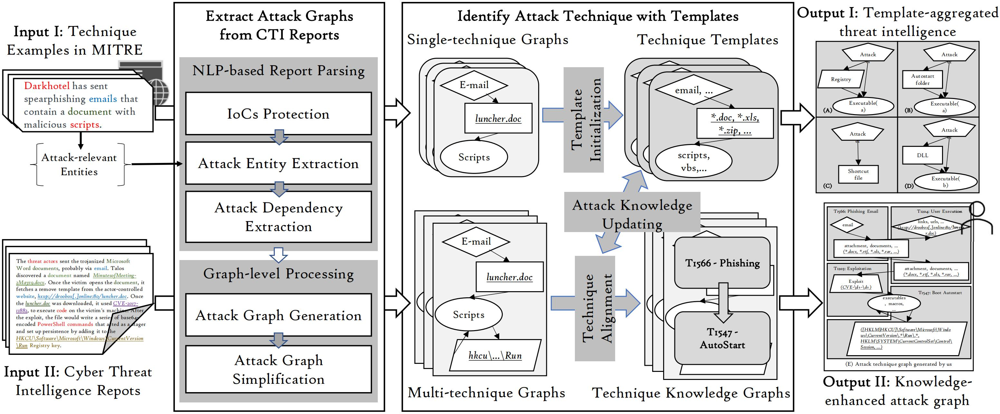
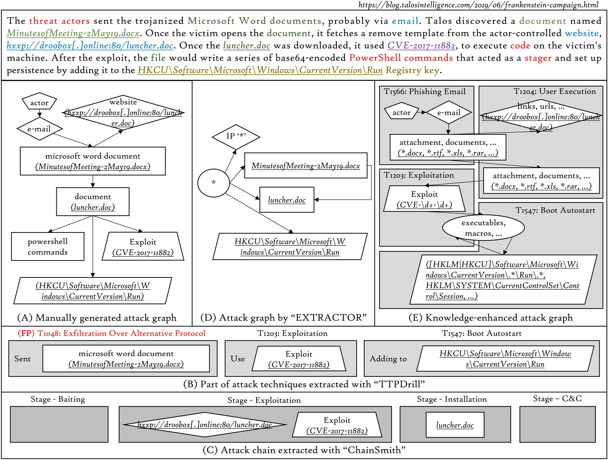

# Knowledge-enhanced-Attack-Graph

## Instructions

Setup:

python 3.8
```
pip install -r requirements.txt
```

Running :
```
# Generating attack graph for CTI report
python main.py -M attackGraphGeneration -R ./reports_sample/Log4Shell.html -O ./output.pdf
# Identifing techniques in CTI report
python main.py -M techniqueIdentification -T ./templates -R ./reports_sample/Log4Shell.html -O ./output.pdf
```

Running - Archive-v0.1 (Archive-v0.1 is the experimental version without clear code structure and comments):
```
# Generating attack graph for CTI report
python attackGraph.py
# Identifing techniques in CTI report
python techniqueIdentifier.py
```

Sample Input and output can be found [here](https://github.com/li-zhenyuan/Knowledge-enhanced-Attack-Graph/tree/main/Results).
Data Model required can bed found [here](https://drive.google.com/drive/folders/1zVGPpN-i-BLlpFqQERscFGb45PkhfkUm?usp=sharing).

---

## Paper 

AttacKG: Constructing Knowledge-enhanced Attack Graphs from Cyber Threat Intelligence Reports

> Cyber attacks are becoming more sophisticated and diverse, making detection increasingly challenging. To combat these attacks, security practitioners actively summarize and exchange their knowledge about attacks across organizations in the form of cyber threat intelligence (CTI) reports. However, as CTI reports written in natural language texts are not structured for automatic analysis, the report usage requires tedious efforts of manual cyber intelligence recovery. Additionally, individual reports typically cover only a limited aspect of attack patterns (techniques) and thus are insufficient to provide a comprehensive view of attacks with multiple variants.
> 
> To take advantage of threat intelligence delivered by CTI reports, we propose AttacKG to automatically extract structured attack behavior graphs from CTI reports and identify the adopted attack techniques. We then aggregate cyber intelligence across reports to collect different aspects of techniques and enhance attack behavior graphs as technique knowledge graphs (TKGs). Such TKGs with technique-level intelligence directly benefit downstream security tasks that rely on technique specifications, e.g., Advanced Persistent Threat (APT) detection.
>
> In our evaluation against 1,515 real-world CTI reports from diverse intelligence sources, AttacKG effectively identifies 28,262 attack techniques with 8,393 unique Indicators of Compromises (IoCs). Further, to verify AttacKG's accuracy in extracting threat intelligence, we run AttacKG on eight manually labeled CTI reports. Empirical results show that AttacKG accurately identifies attack-relevant entities, dependencies, and techniques with F1-scores of 0.895, 0.911, and 0.819, which significantly outperforms the state-of-the-art approaches like EXTRACTOR~\cite{Satvat2021} and TTPDrill~\cite{Husari2017}.'''

### System Architecture



<center> 
Figure 1. Overview of AttacKG architecture. 
</center> 

> AttacKG takes two inputs: (1) technique procedure examples from MITRE describing individual attack techniques; (2) real-world CTI reports describing end-to-end attack workflow, and provides two outputs: (1) technique templates that aggregate technique-level threat intelligence across reports; (2) attack graphs enhanced with aggregated technique intelligence.


### Motivating Example


<center> 
Figure 1. Motivating example.
</center> 

> It is a typical multi-stage attack campaign that nowadays consists of multiple atomic techniques.
To evade detection, such attacks can be morphed easily by replacing any technique with an alternative one. 
Therefore, it is recommended to detect and investigate cyber attacks at the technical level, which is more robust and semantically richer.
>
> Research progress has been made to automatically extract knowledge about attacks from CTI reports.
Subfigures (B) to (D) show the information retrieved from the report sample by EXTRACTOR, and ChainSmith, respectively, while Subfigure (A) represents the manually generated ground-truth.
Subfigure (D) presents the attack graph generated by EXTRACTOR with IoCs and dependencies. Note that EXTRACTOR aggregates all non-IoC entities of the same type and thus loses the structural information of attack behaviors, making it impossible to identify the technique accurately.
Subfigure (B) shows attack techniques identified by TTPDrill with manual-defined threat ontology. As shown, TTPDrill can only extract separate techniques from CTI reports without the whole picture. Besides, the ontologies provided by TTPDrill containing only action-object pairs for technique identification are too vague to lead to many false positives.  As the example shows, sending a document is recognized as exfiltration in TTPDrill. However, in this scenario, the ``trojanized'' document is sent by an attacker for exploitation.
Detailed comparisons are demonstrated in Section~\ref{sec:evaluation}.
As shown in Subfigure (C), ChainSmith provides a semantic layer on top of IoCs that captures the role of IoCs in a malicious campaign. They only give a coarse-grained four-stage classification with limited information.
>
> Subfigure (E) illustrates the ideal result we want to extract in this paper. As long as we can identify attack techniques in attack graphs extracted from CTI reports, we are able to enrich the attack graphs with more comprehensive knowledge about the corresponding techniques. For example, we can find more possible vulnerabilities that can be used in \texttt{T1203 - Exploitation for Execution} as a replacement for \texttt{CVE-2017-11882} appeared in this report. Moreover, the distinct threat intelligence can be collected and aggregated at the technique level across massive reports.
